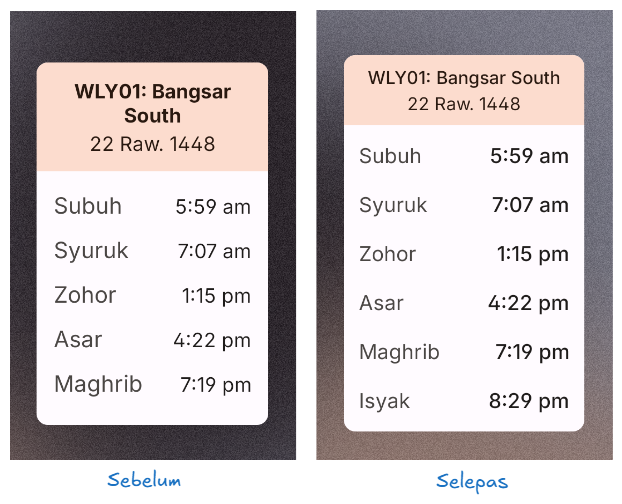
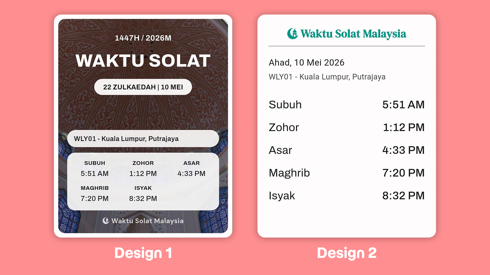
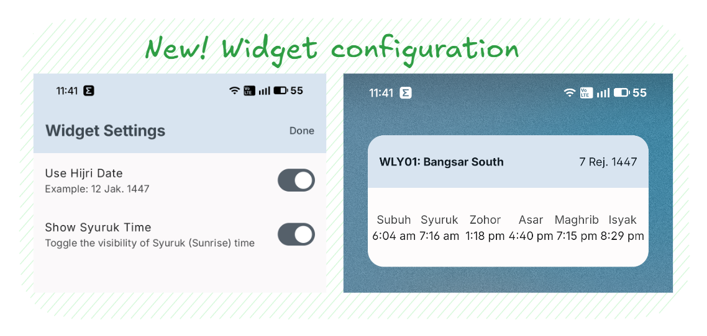
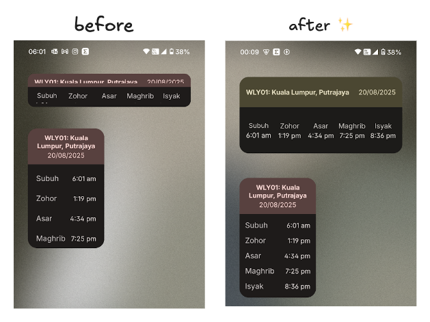
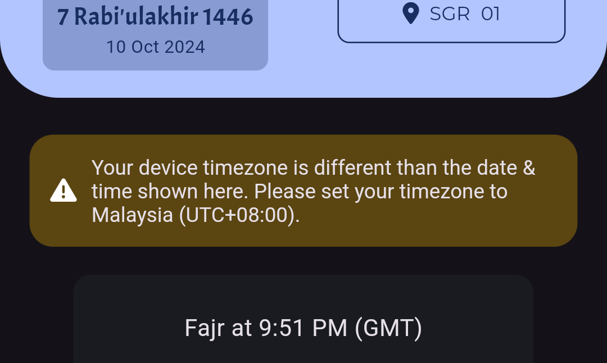
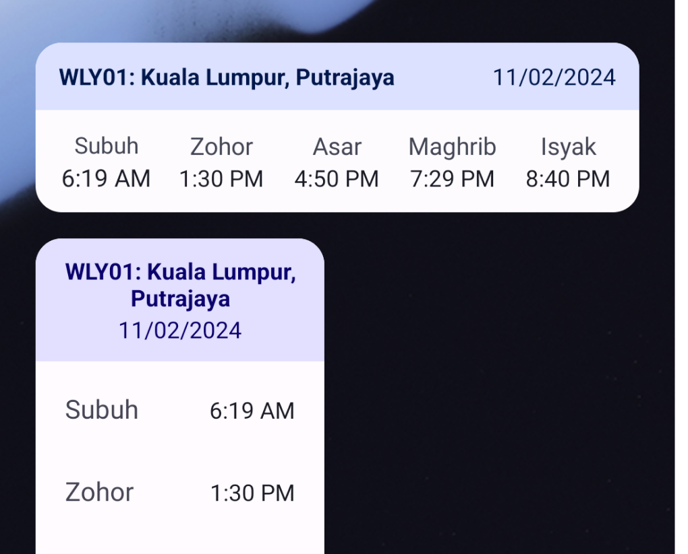

## <a id="2.14.3" href="#2.14.3" class="release-hash">#</a> Version 2.14.3 9 September 2026 | 27 Rabiulawal 1448 [GitHub ↗](https://github.com/mptwaktusolat/app_waktu_solat_malaysia/releases/tag/2.14.3+176)

- Waktu **Dhuha** now is shown based on JAKIM API, not calculated on device. JAKIM recently introduced this change. [#281](https://github.com/mptwaktusolat/app_waktu_solat_malaysia/pull/281)
- Make **homescreen widget more compact** to prevent text or elements cutting off. Applied for both horizontal and vertical widget. For example, see screenshot below, notice that previously, the Isyak time is clipped when the available height is not enough. Now, it is visible. Note that the widget size is same on both images. [#275](https://github.com/mptwaktusolat/app_waktu_solat_malaysia/issues/275) [#276](https://github.com/mptwaktusolat/app_waktu_solat_malaysia/issues/276) [#282](https://github.com/mptwaktusolat/app_waktu_solat_malaysia/pull/282)
  

## <a id="2.14.2" href="#2.14.2" class="release-hash">#</a> Version 2.14.2 4 July 2026 | 18 Muharram 1448 [GitHub ↗](https://github.com/mptwaktusolat/app_waktu_solat_malaysia/releases/tag/2.14.2+175)

- Fix bug from previous release that causes the text on coachmarks doesn't show when in Dark Mode. See issue [#279](https://github.com/mptwaktusolat/app_waktu_solat_malaysia/issues/279).
- Update app icon on flutter side.

## <a id="2.14.1" href="#2.14.1" class="release-hash">#</a> Version 2.14.1 3 July 2026 | 17 Muharram 1448 [GitHub ↗](https://github.com/mptwaktusolat/app_waktu_solat_malaysia/releases/tag/2.14.1+174)

- Update color of some UI elements to be more distinguish and make UI seperation more visible. For example, the bottom app bar now have slighly tinted so it differs from the background scaffold. See PR [#277](https://github.com/mptwaktusolat/app_waktu_solat_malaysia/pull/277).
- Update homescreen widget preview image to use up to date colors and UI.
- Update the mosque images (background image for full timetable page) URLs.
- Update app icon to filled icon. Previously was using line style icon. See PR [#278](https://github.com/mptwaktusolat/app_waktu_solat_malaysia/pull/278) for details.
  

## <a id="2.14.0" href="#2.14.0" class="release-hash">#</a> Version 2.14.0 18 May 2026 | 1 Zulhijjah 1447 [GitHub ↗](https://github.com/mptwaktusolat/app_waktu_solat_malaysia/releases/tag/2.14.0+173)

- Refreshed the **Share as Image** feature with improved visuals and layout styling.
  
- Added padding to the bottom of **monthly timetable page** to prevent the last row from being obscured by the download button.
- Upgrade dependencies
- [DEV]
  - Added ability to turn the developer mode off.

## <a id="2.13.11" href="#2.13.11" class="release-hash">#</a> Version 2.13.11 8 April 2026 | 19 Syawal 1447 [GitHub ↗](https://github.com/mptwaktusolat/app_waktu_solat_malaysia/releases/tag/2.13.11+170)

- Fix bug that causes the app to stuck at splash screen on launches. The issue was caused by the app couldn't find the provided timezone data. Issue [#270](https://github.com/mptwaktusolat/app_waktu_solat_malaysia/issues/270)

## <a id="2.13.10" href="#2.13.10" class="release-hash">#</a> Version 2.13.10 7 April 2026 | 18 Syawal 1447 [GitHub ↗](https://github.com/mptwaktusolat/app_waktu_solat_malaysia/releases/tag/2.13.10+169)

Selamat Hari Raya! 🕌

- Update [auto_start_flutter](https://pub.dev/packages/auto_start_flutter) and [flutter_local_notifications](https://pub.dev/packages/flutter_local_notifications) and other dependencies to latest versions.
- Remove `android.enableJetifier` property from gradle.properties.
- Refactor Qibla page layout so it rendered better on tablets, or when phone is in landscape mode.

## <a id="2.13.9" href="#2.13.9" class="release-hash">#</a> Version 2.13.9 31 January 2026 | 12 Sya'ban 1447 [GitHub ↗](https://github.com/mptwaktusolat/app_waktu_solat_malaysia/releases/tag/2.13.9+168)

- Add restart onboarding page button in About dialog settings
- Fix oversized theme toggle animation (the sun & moon animation) & optimize theme selection UI for tablets. [[Screenshots]](https://github.com/mptwaktusolat/app_waktu_solat_malaysia/commit/6a936fa72b3a2cebecebd2f9a451301a684ae7a7#commitcomment-176085615)
- Update Android Gradle Plugin (AGP) to 8.13.2.
- Update dependencies
- Add Flutter version info to debug dialog
- Remove Impeller opt-out override from Android manifest

## <a id="2.13.8" href="#2.13.8" class="release-hash">#</a> Version 2.13.8 28 December 2025 | 7 Rejab 1447 [GitHub ↗](https://github.com/mptwaktusolat/app_waktu_solat_malaysia/releases/tag/2.13.8+167)

- Added ability to configure the **homescreen widget**. You can now choose to display the **Hijri date** and the **Syuruk time** in the widget views. You can open the widget settings page by holding the widget, and tap on the settings icon.

  

  If you would like to see other elements to be configurable, kindly let me know (You can do that via feedback page in the app, or via [GitHub issues](https://github.com/mptwaktusolat/app_waktu_solat_malaysia/issues))

- Few UI improvements in update dialog, button badge, etc.
- Update dependencies

## <a id="2.13.7" href="#2.13.7" class="release-hash">#</a> Version 2.13.7 14 December 2025 | 23 Jamadilakhir 1447 [GitHub ↗](https://github.com/mptwaktusolat/app_waktu_solat_malaysia/releases/tag/2.13.7+163)

- Added labels for both vertical and horizontal **Android homescreen** widget layouts for improved clarity. [[Screenshot]](https://github.com/mptwaktusolat/app_waktu_solat_malaysia/commit/4601ab887f415238dec3003f03614ef71ef1aae9#commitcomment-172690166)
- Added Safe Area support to Qibla Checker pages to ensure proper display on all devices.
- Fixed an issue where the PDF export dialog appeared behind the system bottom bar.
- Updated dependencies.
- Refactors code for better maintainability.

## <a id="2.13.6" href="#2.13.6" class="release-hash">#</a> Version 2.13.6 20 October 2025 | 28 Rabi'ulakhir 1447 [GitHub ↗](https://github.com/mptwaktusolat/app_waktu_solat_malaysia/releases/tag/2.13.6+162)

- Update UI for manual zone picker. Supports better animation and overall UX especially on tablets/wide screen devices. [[Video]](https://imgur.com/a/8RigJBF)
- Update dependencies.

## <a id="2.13.5" href="#2.13.5" class="release-hash">#</a> Version 2.13.5 16 September 2025 | 23 Rabi'ulawal 1447 [GitHub ↗](https://github.com/mptwaktusolat/app_waktu_solat_malaysia/releases/tag/2.13.5+160)

Selamat Hari Malaysia! 🇲🇾

- Fixes an **issue where some UI elements were obscured** by the bottom navigation bar. This issue is more prominent on devices with button navigation enabled. (Issue [#258](https://github.com/mptwaktusolat/app_waktu_solat_malaysia/issues/258))
- **Flutter info** is now included in when you submit feedback via the feedback page. This will help in diagnosing issues related to specific Flutter versions.

## <a id="2.13.4" href="#2.13.4" class="release-hash">#</a> Version 2.13.4 21 August 2025 | 27 Safar 1447 [GitHub ↗](https://github.com/mptwaktusolat/app_waktu_solat_malaysia/releases/tag/2.13.4+159)

Enhancements to the homescreen widget (Issue [#250](https://github.com/mptwaktusolat/app_waktu_solat_malaysia/issues/250))

- The horizontal-type widget now supports vertical resizing, fixing an issue where text was cut off on certain launchers.
- The vertical-type widget now has reduced text spacing for better readability.

  

## <a id="2.13.3" href="#2.13.3" class="release-hash">#</a> Version 2.13.3 20 July 2025 | 24 Muharram 1447 [GitHub ↗](https://github.com/mptwaktusolat/app_waktu_solat_malaysia/releases/tag/2.13.3+158)

- Fix homescreen widget issues that displays _2.56 PM_ for all 5 prayer times. This is due to the change in time format passed to the native side, causing the date time parser
  fails to format the time correctly. Closes issue [#255](https://github.com/mptwaktusolat/app_waktu_solat_malaysia/issues/255)

## <a id="2.13.2" href="#2.13.2" class="release-hash">#</a> Version 2.13.2 20 July 2025 | 24 Muharram 1447 [GitHub ↗](https://github.com/mptwaktusolat/app_waktu_solat_malaysia/releases/tag/2.13.2+156)

- Fixed an issue where the monthly timetable page would not load when opened for the first time. Closes issue [#254](https://github.com/mptwaktusolat/app_waktu_solat_malaysia/issues/254)
- Fix critical bug that would prevent the cache from being invalidated despite changing months & year.

## <a id="2.13.1" href="#2.13.1" class="release-hash">#</a> Version 2.13.1 19 July 2025 | 23 Muharram 1447 [GitHub ↗](https://github.com/mptwaktusolat/app_waktu_solat_malaysia/releases/tag/2.13.1+156)

This release focuses on internal improvements, stability, and keeping up with platform requirements. No major UI changes were introduced, but these changes help us build a better foundation for future features.

- Fixed an issue on **Monthly Timetable page** where the screen scrolls incorrectly when the date is 1. This should improve the overall usability of the timetable view. Related to [#233](https://github.com/mptwaktusolat/app_waktu_solat_malaysia/issues/233)
- Introduced internal **WaktuSolat Client Package** to better handle data fetching from the API. This paves the way for easier maintenance and future improvements.
- Upgraded to **targetSdkVersion 35**, as required by Google Play for app compatibility and future support.
- Upgraded core dependencies to latest versions for better performance and stability.
- [DEV]
  - Refactored several files and folders to improve code organization and structure.
  - Removed debug logging, `HttpOverrides`, and other unused development-related code.

## <a id="2.13.0" href="#2.13.0" class="release-hash">#</a> Version 2.13.0 30 March 2025 | 29 Ramadhan 1446 [GitHub ↗](https://github.com/mptwaktusolat/app_waktu_solat_malaysia/releases/tag/2.13.0+155)

- Added ability to **share prayer time as image**. Now you can easily share the prayer times with your friends and family through a beautifully formatted image. Related to [#248](https://github.com/mptwaktusolat/app_waktu_solat_malaysia/issues/248). _This is the first iteration and will improve in further releases. Feedbacks are welcomed._
- Added new zone in Pahang: **PHG07** - _Zon Khas Daerah Rompin, (Mukim Rompin, Mukim Endau, Mukim Pontian)_. Closes [#249](https://github.com/mptwaktusolat/app_waktu_solat_malaysia/issues/249).
- Updated UI for Update Checker page
- Improved error messages when failed to fetch API data
- Regenerated Android project with updated Gradle configuration
- Disabled Impeller renderer on Android
- Other code optimizations and improvements

## <a id="2.12.7" href="#2.12.7" class="release-hash">#</a> Version 2.12.7 19 January 2025 | 19 Rejab 1446 [GitHub ↗](https://github.com/mptwaktusolat/app_waktu_solat_malaysia/releases/tag/2.12.7+152)

- Enabled **additional times** (Syuruk, Imsak & Dhuha) by default.

  I received frequent feedback requesting
  to display the Syuruk/Imsak/Dhuha times. The app already supports this feature and can be enabled in the settings. However, it seems
  some users don't know how to change the settings. Hence, we've made it on by default. Users can still change this setting
  in the settings page. Related to issue [#171](https://github.com/mptwaktusolat/app_waktu_solat_malaysia/issues/171)

- Added **grid view** layout on tablets & phone landscape. Related issue [#175](https://github.com/mptwaktusolat/app_waktu_solat_malaysia/issues/175)
- Updated localizations for better language support
- Fixed issue with GitHub URL on Feedback Page
- Upgraded dependencies for improved performance and stability

## <a id="2.12.6" href="#2.12.6" class="release-hash">#</a> Version 2.12.6 11 October 2024 | 8 Rabi'ulakhir 1446 [GitHub ↗](https://github.com/mptwaktusolat/app_waktu_solat_malaysia/releases/tag/2.12.6+151)

- Added timezone checker (A banner will appear if device timezone is not the same as Malaysia's)
  
- (About page) Changed Share button location to side of the app logo - Removed Contributions Page
- (Full Timetable page) Fixed appbar appearance to increase visibility of background image & text
- Upgraded dependencies

## <a id="2.12.5" href="#2.12.5" class="release-hash">#</a> Version 2.12.5 1 September 2024 [GitHub ↗](https://github.com/mptwaktusolat/app_waktu_solat_malaysia/releases/tag/2.12.5+150)

- Fixed issue where **homescreen widget** failed to update in September due to incorrect locale setting. See [#244](https://github.com/mptwaktusolat/app_waktu_solat_malaysia/issues/244)
- Added **onboarding coachmarks** for first installs (or first open after the update)
- Upgraded dependencies

## <a id="2.12.4" href="#2.12.4" class="release-hash">#</a> Version 2.12.4 17 July 2024 | 10 Muharram 1446 [GitHub ↗](https://github.com/mptwaktusolat/app_waktu_solat_malaysia/releases/tag/2.12.4+149)

- Updated Android project folder - Updated `targetSdkVersion` to 34 and others
- Updated dependencies

## <a id="2.12.3" href="#2.12.3" class="release-hash">#</a> Version 2.12.3 1 April 2024 | 21 Ramadan 1445 [GitHub ↗](https://github.com/mptwaktusolat/app_waktu_solat_malaysia/releases/tag/2.12.3+147)

- Enhanced UX for azan notification, particularly on **Android 13+** since they require granting [runtime notification permission](https://source.android.com/docs/core/display/notification-perm).
  This includes displaying permission dialog before actually asking the permission so that users are aware why they need to grant that permission. Also, the app now checks the permission status on
  startup, and will prompt the user to grant the permission if needed ([like this](https://github.com/mptwaktusolat/app_waktu_solat_malaysia/assets/60868965/da956dd8-beda-4aa8-8b2f-d6112e708dec)). PR [#230](https://github.com/mptwaktusolat/app_waktu_solat_malaysia/pull/230).
- **This part is a bit technical**, in this update I'm also changing the method to schedule notification/azan to [alarmClock](<https://developer.android.com/reference/android/app/AlarmManager#setAlarmClock(android.app.AlarmManager.AlarmClockInfo,%20android.app.PendingIntent)>) _(previously using [setExactAndAllowWhileIdle](<https://developer.android.com/reference/android/app/AlarmManager#setExactAndAllowWhileIdle(int,%20long,%20android.app.PendingIntent)>))_. This is an attempt to fix various issues
  regarding the notification/azan such as it [not going off](https://github.com/mptwaktusolat/app_waktu_solat_malaysia/issues/115), being delayed, etc. This implementation may be temporary.

## <a id="2.12.2" href="#2.12.2" class="release-hash">#</a> Version 2.12.2 19 February 2024 | 9 Syaa'ban 1445 [GitHub ↗](https://github.com/mptwaktusolat/app_waktu_solat_malaysia/releases/tag/2.12.2+146)

- Fixed app **crashes on launch** on **Android 14+** devices if the homescreen widget was added. The crashes are caused because the app is trying
  to schedule the widget update using [`setExact`](<https://developer.android.com/reference/android/app/AlarmManager#setExact(int,%20long,%20android.app.PendingIntent)>) alarm when the required [permission](https://developer.android.com/develop/background-work/services/alarms/schedule#using-schedule-exact-permission) is not granted by the user. Issue [#228](https://github.com/mptwaktusolat/app_waktu_solat_malaysia/issues/228)

## <a id="2.12.1" href="#2.12.1" class="release-hash">#</a> Version 2.12.1 13 February 2024 | 3 Syaa'ban 1445 [GitHub ↗](https://github.com/mptwaktusolat/app_waktu_solat_malaysia/releases/tag/2.12.1+145)

- Fixed issue where some widget layout would shift due to missing `layout_weight` property.
- Added Bahasa Melayu translation in homescreen widget.
- Prevented crashes in some situations when checking for updates.

## <a id="2.12.0" href="#2.12.0" class="release-hash">#</a> Version 2.12.0 11 February 2024 | 1 Syaa'ban 1445 [GitHub ↗](https://github.com/mptwaktusolat/app_waktu_solat_malaysia/releases/tag/2.12.0+144)

- Homescreen widget now follows [**dynamic color**](https://developer.android.com/develop/ui/views/appwidgets/enhance#dynamic-colors). Closed [#222](https://github.com/mptwaktusolat/app_waktu_solat_malaysia/issues/222)
  
- Fixed issue where prayer data wouldn't show in homescreen widget when new month comes. Fixed [#224](https://github.com/mptwaktusolat/app_waktu_solat_malaysia/issues/224)
- Minor adjustment to horizontal homescreen widget layout. Maybe fixes [#218](https://github.com/mptwaktusolat/app_waktu_solat_malaysia/issues/218)
- Refactored code to adapt [new way](https://kazlauskas.dev/blog/flutter-app-lifecycle-listener-overview/#is-there-a-difference) of listening for app lifecycle events
- Upgraded pub dependencies

## <a id="2.11.3" href="#2.11.3" class="release-hash">#</a> Version 2.11.3 15 January 2024 | 3 Rejab 1445 [GitHub ↗](https://github.com/mptwaktusolat/app_waktu_solat_malaysia/releases/tag/2.11.3+143)

- Fixed bug on **homescreen widget** where it shows the incorrect prayer time data. Issue [#219](https://github.com/mptwaktusolat/app_waktu_solat_malaysia/issues/219). Thanks to MPT user who reported this issue.
- Made Send button in feedback page larger, easier to find. [13ed004](https://github.com/mptwaktusolat/app_waktu_solat_malaysia/commit/13ed00421a508b19c1450664e27d86a73ad24ef8)
- Updated dependencies

## <a id="2.11.1" href="#2.11.1" class="release-hash">#</a> Version 2.11.1 4 January 2024 | 22 J.Akhir 1445 [GitHub ↗](https://github.com/mptwaktusolat/app_waktu_solat_malaysia/releases/tag/2.11.1+141)

Due to the [Jan 1 Incident](https://github.com/mptwaktusolat/app_waktu_solat_malaysia/issues/216) issue, some changes are made to improve the stability of the app.

- Fixed **Homescreen widget** error view that never triggered.
- Skipped storing cache if the API response can't be parsed by the equivalent model
- Changed the **cache key** for API response, because some users still have the error

Other chores:

- Updated dependencies
- Updated website, link & references

## <a id="2.11.0" href="#2.11.0" class="release-hash">#</a> Version 2.11.0 27 December 2023 | 14 J.Akhir 1445 [GitHub ↗](https://github.com/mptwaktusolat/app_waktu_solat_malaysia/releases/tag/2.11.0+140)

- Added [**Android Homescreen widget**](https://github.com/mptwaktusolat/app_waktu_solat_malaysia/pull/214). Finally closes issue [#9](https://github.com/mptwaktusolat/app_waktu_solat_malaysia/issues/9)
- Fixed autoscroll 'terlajak' in full prayer timetable. Issue [#213](https://github.com/mptwaktusolat/app_waktu_solat_malaysia/issues/213)
- Requested to schedule exact alarm notification for Android 13+

## <a id="2.10.1" href="#2.10.1" class="release-hash">#</a> Version 2.10.1 5 December 2023 [GitHub ↗](https://github.com/mptwaktusolat/app_waktu_solat_malaysia/releases/tag/2.10.1+137)

- Reverted [`PopScope` migration](https://docs.flutter.dev/release/breaking-changes/android-predictive-back#migration-guide) as it breaks the manual location selector dialog. [[Video]](https://imgur.com/a/prW2NsL)

## <a id="2.10.0" href="#2.10.0" class="release-hash">#</a> Version 2.10.0 26 November 2023 [GitHub ↗](https://github.com/mptwaktusolat/app_waktu_solat_malaysia/releases/tag/2.10.0+136)

- Added feature to **download/save/print** monthly prayer times timetable. [[Demo]](https://imgur.com/O8lOXkn)
- Upgraded dependencies
- Bumped Android `minSdkVersion` to 21 (Due to `fluttertoast` plugin)
- Fixed visual bug that caused the header in full timetable page not reacting on scroll.
- [DEV]
  - Fixed lints etc.

## <a id="2.9.3" href="#2.9.3" class="release-hash">#</a> Version 2.9.3 19 October 2023 [GitHub ↗](https://github.com/mptwaktusolat/app_waktu_solat_malaysia/releases/tag/2.9.3+135)

- Added missing **Malay translations** in manual zone selector page
- Upgraded dependencies (including multiple major version packages)
- [DEV]
  - Fixed lints rule

## <a id="2.9.2" href="#2.9.2" class="release-hash">#</a> Version 2.9.2 27 August 2023 | 10 Safar 1445 [GitHub ↗](https://github.com/mptwaktusolat/app_waktu_solat_malaysia/releases/tag/2.9.2+134)

- Added **monochrome icons** variant. For devices with support of theme icons (Android 13+), the app icon will match the system wallpapers. [[Screenshots]](https://imgur.com/a/0o1CEcL)
- Updated dependencies (and upgraded to latest Flutter stable 3.13.x)
- **Autoscroll to current day** row in full timetable page. [[See Tweet]](https://twitter.com/iqfareez/status/1694489825674682702?s=20)
- Added nice, subtle and welcoming **entry animation** for the prayer time list. [[See Tweet]](https://twitter.com/iqfareez/status/1695646043210445294?s=20)
- [DEV]
  - Code cleaning and refactoring

## <a id="2.9.1" href="#2.9.1" class="release-hash">#</a> Version 2.9.1 27 August 2023 | 23 Muharram 1445 [GitHub ↗](https://github.com/mptwaktusolat/app_waktu_solat_malaysia/releases/tag/2.9.1+133)

- Possible fix to [#203](https://github.com/mptwaktusolat/app_waktu_solat_malaysia/issues/203) again. Crashlytics dashboard is full of this issue. 🤷
- Updated text not visible on button. [Screenshot](https://imgur.com/HomLSib)
- Allowed expired certificate from [mpt-server](https://mpt-server.vercel.app). This is to allow prayer data to be fetched when running on older Android versions.
- Updated dependencies
- Opted in to use [badges](https://pub.dev/packages/badges) package instead of custom widget [Screenshots](https://imgur.com/a/rdEiEJ6)
- [DEV]
  - Renamed files to follow Dart naming conventions 1699404 c32e3ff ba95b70
  - Fixed imports conventions 2e949d6

## <a id="2.9.0" href="#2.9.0" class="release-hash">#</a> Version 2.9.0 27 August 2023 | 27 Zulhijjah 1444 [GitHub ↗](https://github.com/mptwaktusolat/app_waktu_solat_malaysia/releases/tag/2.9.0+132)

- Using the latest API update from [mpt-server](http://api.waktusolat.app)
  - Prayer time API now using [solat-v2](https://api.waktusolat.app/docs#tag/solat-v2/get/v2/solat/%7Bzone%7D) endpoint
  - **Improved accuracy** when detecting prayer zone - now using pre-defined zone definition instead of just calculating the nearest point of the prayer time zone to the user location. For more details, please see issue [#188](https://github.com/mptwaktusolat/app_waktu_solat_malaysia/issues/188)
- Upgraded dependencies (major ones included: [http](https://pub.dev/packages/http), [google_fonts](https://pub.dev/packages/google_fonts), [flutter_local_notifications](https://pub.dev/packages/flutter_local_notifications), [app_settings](https://pub.dev/packages/app_settings))
- Possibly fixed error related to notification scheduling. [#203](https://github.com/mptwaktusolat/app_waktu_solat_malaysia/issues/203)
- Reverted adding the error message in zone_chooser dialog [5adc2cd](https://github.com/mptwaktusolat/app_waktu_solat_malaysia/commit/5adc2cdfee32f05c81643bba7eebec1b5e83b69c)
- DEV:
  - Fixed some of the file names with respect to linter rule [`lowercase_with_underscores`](https://dart.dev/tools/linter-rules/file_names)
  - Bumped kotlin version to the `1.8.22` (due to `app_settings` requirement)

## <a id="2.8.3" href="#2.8.3" class="release-hash">#</a> Version 2.8.3 18 Jun 2023 | 29 Zulkaedah 1444 [GitHub ↗](https://github.com/mptwaktusolat/app_waktu_solat_malaysia/releases/tag/2.8.3+130)

- Updated **JAKIM location** database (Comes with zone changes and addition especially for Sarawak, etc.) [011cb86](https://github.com/mptwaktusolat/app_waktu_solat_malaysia/commit/011cb864596a8a231d7f00ce24261b714feae712)

## <a id="2.8.2" href="#2.8.2" class="release-hash">#</a> Version 2.8.2 13 Jun 2023 | 24 Zulkaedah 1444 [GitHub ↗](https://github.com/mptwaktusolat/app_waktu_solat_malaysia/releases/tag/2.8.2+129)

- Fixed notification bug where it fails to schedule some prayer notification due to notification ID collision. See [#201](https://github.com/mptwaktusolat/app_waktu_solat_malaysia/issues/201)

## <a id="2.8.1" href="#2.8.1" class="release-hash">#</a> Version 2.8.1 19 May 2023 | 28 Syawal 1444 [GitHub ↗](https://github.com/mptwaktusolat/app_waktu_solat_malaysia/releases/tag/2.8.1+128)

- New and **refreshed zone selection** UI. [#196](https://github.com/mptwaktusolat/app_waktu_solat_malaysia/issues/196)
  - Fixed zone not sorted correctly. [#187](https://github.com/mptwaktusolat/app_waktu_solat_malaysia/issues/187)
- Current **active prayer time is now highlighted** in the prayer time list. _For example, if the current time is 2:12 PM, the Zohor prayer time will be highlighted in the prayer time list._
- Fixed text not visible when dark mode is on.
- Upgraded to [Flutter 3.10](https://docs.flutter.dev/release/release-notes/release-notes-3.10.0) 💙
- Updated dependencies: [package_info_plus](https://pub.dev/packages/package_info_plus), [device_info_plus](https://pub.dev/packages/device_info_plus), [share_plus](https://pub.dev/packages/share_plus), [flutter_local_notifications](https://pub.dev/packages/flutter_local_notifications), [google_mobile_ads](https://pub.dev/packages/google_mobile_ads)
- DEV:
  - Reports platforms error to Crashlytics [a78f508](https://github.com/mptwaktusolat/app_waktu_solat_malaysia/commit/a78f5086bdb74b97c496e530f1c71f1b342bd954)
  - Fixed some lint errors [203cb8d](https://github.com/mptwaktusolat/app_waktu_solat_malaysia/commit/203cb8dba1019aeb8c3d3755912fe127b48c1882)

## <a id="2.8.0" href="#2.8.0" class="release-hash">#</a> Version 2.8.0 22 April 2023 | 1 Syawal 1444 [GitHub ↗](https://github.com/mptwaktusolat/app_waktu_solat_malaysia/releases/tag/2.8.0+126)

- Revamped design to [**Material You**](https://source.android.com/docs/core/display/material) (or Material 3). Feel more rounded corners, improved designs and clean UIs.
- The app themes now matched the phone's theme colours (usually derived from the wallpaper) for supported phones only.
- Increased **default text size** for prayer time text to `16`.
- **Relocated the Ads widget** to the top. So that the location of floating action button and snackbar are restored.
- Updated copyright year to `2023` _Yeah, I know it's pretty late.._
- Requested **notification permission** on onboarding screen (for **Android 13+** only). Previously, the app notification would be requested on the second app launches, so user wouldn't receive the scheduled notification after the first launch.
  - Bumped `targetSdkVersion` to 33
- Upgraded dependencies
- Skipped Autostart banner for **Samsung devices** because it was found unnecessary. User couldn't even change the app settings.

## <a id="2.7.6" href="#2.7.6" class="release-hash">#</a> Version 2.7.6 31 March 2023 | 9 Ramadhan 1444 [GitHub ↗](https://github.com/mptwaktusolat/app_waktu_solat_malaysia/releases/tag/2.7.6+122)

- Fixed Google Play Policy issue. See [#180](https://github.com/mptwaktusolat/app_waktu_solat_malaysia/issues/180). Yes, again (╯°□°）╯︵ ┻━┻
- Upgraded dependencies

## <a id="2.7.5" href="#2.7.5" class="release-hash">#</a> Version 2.7.5 15 March 2023 | 22 Sya'ban 1444 [GitHub ↗](https://github.com/mptwaktusolat/app_waktu_solat_malaysia/releases/tag/2.7.5+121)

- Fixed Google Play Policy issue. See [#180](https://github.com/mptwaktusolat/app_waktu_solat_malaysia/issues/180).
- Upgraded dependencies

## <a id="2.7.4" href="#2.7.4" class="release-hash">#</a> Version 2.7.4 4 March 2023 | 11 Sya'ban 1444 [GitHub ↗](https://github.com/mptwaktusolat/app_waktu_solat_malaysia/releases/tag/2.7.4+120)

- Fixed azan notification issue that plays Azan subuh for every prayer time. See issue [#173](https://github.com/mptwaktusolat/app_waktu_solat_malaysia/issues/173)
- Renamed app label. Malaysia Prayer Time is now **`Prayer Time`** (Waktu Solat Malaysia is now **`Waktu Solat`**). See [#174](https://github.com/mptwaktusolat/app_waktu_solat_malaysia/issues/174)
- Removed unused widgets, added missing tooltips.

## <a id="2.7.3" href="#2.7.3" class="release-hash">#</a> Version 2.7.3 3 February 2023 [GitHub ↗](https://github.com/mptwaktusolat/app_waktu_solat_malaysia/releases/tag/2.7.3+119)

- Added new notification option: **Short Azan**. This notification will only play the first "Allahu Akbar x2" of the azan. Maqam [Lamy](https://soundcloud.com/alafasy/lamy2005?in=alafasy/sets/athan&si=a1d4eccfcf5d4ffcaef14287ed7f8bc4&utm_source=clipboard&utm_medium=text&utm_campaign=social_sharing) by Mishary Rashid Al-Afasy [#158](https://github.com/mptwaktusolat/app_waktu_solat_malaysia/issues/158)
- Added **azan preview** in notification settings. User can now quickly fire notification to hear how they sound like.
- Minor **UI tweak** when asking user to restart app after modifying the notification setting. [[Screenshot]](https://imgur.com/cruEqLG)
- Upgraded to [**Flutter 3.7**](https://docs.flutter.dev/development/tools/sdk/release-notes/release-notes-3.7.0)
- Upgraded dependencies (major: [flutter_local_notifications](https://pub.dev/packages/flutter_local_notifications), [google_fonts](https://pub.dev/packages/google_fonts), [flutter_svg](https://pub.dev/packages/flutter_svg))
- Updated **location** based on new JAKIM's location. Added `NGS03` and replaced `KTN03` to `KTN02`. [#164](https://github.com/mptwaktusolat/app_waktu_solat_malaysia/issues/164)
- Updated copyright year (2023)
- Made banner ads no longer inside a scroll view. This is to comply with Google's policy. But, the share button is no longer can be docked on the bottom navigation bar :( [#168](https://github.com/mptwaktusolat/app_waktu_solat_malaysia/issues/168). [[Screenshot]](https://imgur.com/5p8AS3i)
- DEV:
  - Renamed some filenames to follow Dart naming convention
  - etc.

## <a id="2.7.1" href="#2.7.1" class="release-hash">#</a> Version 2.7.1 2 December 2022 [GitHub ↗](https://github.com/mptwaktusolat/app_waktu_solat_malaysia/releases/tag/2.7.1+115)

- Upgraded dependencies (major): [package_info_plus](https://pub.dev/packages/package_info_plus), [device_info_plus](https://pub.dev/packages/device_info_plus), [share_plus](https://pub.dev/packages/share_plus), [geolocator](https://pub.dev/packages/geolocator), [firebase_core](https://pub.dev/packages/firebase_core), [firebase_analytics](https://pub.dev/packages/firebase_analytics), [flutter_local_notifications](https://pub.dev/packages/flutter_local_notifications) & [firebase_crashlytics](https://pub.dev/packages/firebase_crashlytics)
  - According to `Flutter Local Notifications`'s [changelog](https://pub.dev/packages/flutter_local_notifications/changelog#1000):
    > `zonedSchedule()`'s implementation has switched to using [desugaring](https://developer.android.com/studio/releases/gradle-plugin#j8-library-desugaring) instead of the [ThreeTen Android Backport library](https://github.com/JakeWharton/ThreeTenABP)...

## <a id="2.6.2-hotfix.1" href="#2.6.2-hotfix.1" class="release-hash">#</a> Version 2.6.2-hotfix.1 27 September 2022 [GitHub ↗](https://github.com/mptwaktusolat/app_waktu_solat_malaysia/releases/tag/2.6.2-hotfix.1+111)

- Reverted to use [flutter_local_notification](https://pub.dev/packages/flutter_local_notifications) version 9.9.1 and [timezone](https://pub.dev/packages/timezone) version 0.8.0. This was due to the issue [#142](https://github.com/mptwaktusolat/app_waktu_solat_malaysia/issues/142)

## <a id="2.6.2" href="#2.6.2" class="release-hash">#</a> Version 2.6.2 26 September 2022 [GitHub ↗](https://github.com/mptwaktusolat/app_waktu_solat_malaysia/releases/tag/2.6.2+110)

- Upgraded dependencies
- **Android 12** support. Bumped `targetSdkVersion` to 31.
- In feedback page, the **letter will auto capitalize** first letter (like WhatsApp etc.)
- Using [MPT-Server](https://mpt-server.vercel.app/)'s API to **get image mosque**
- Open link when tapping on copyright information
- DEV
  - Renamed some folders to follow Dart naming convention
  - Started writing some tests
  - Refactored some classes

## <a id="2.6.0" href="#2.6.0" class="release-hash">#</a> Version 2.6.0 8 September 2022 [GitHub ↗](https://github.com/mptwaktusolat/app_waktu_solat_malaysia/releases/tag/2.6.0+108)

- In full prayer timetable, the background image will show a [mosque](https://waktusolat.iqfareez.com/mosques) according to user's current zone. [[Screenshot]](https://imgur.com/ghzaxUe)
- Display detected geocoding as `subLocality` as it appears to be more specific to the location. For example, the app shows `Pusat Bandar Wangsa Maju` instead of generic `Kuala Lumpur`. [[Screenshot]](https://imgur.com/3yhZmcJ)
- Added **shake** widget on onboarding screen for Autostart admonition (not all phones) to alert the users to enable it. [[Video]](https://imgur.com/qDhsRcU)
- [MPT-Server](http://api.waktusolat.app) API will now be used as primary API to prayer time data, backed up with JAKIM API.
- Added keyboard autofill hints in email field in feedback page. [[Screenshot]](https://imgur.com/yGJEcwV)
- [DEV]
  - Upgraded to **Flutter 3.3**.
  - Upgraded dependencies (major: [geolocator](https://pub.dev/packages/geolocator), [quick_actions](https://pub.dev/packages/quick_actions))
  - Bumped `compileSdkVersion` to 33.
  - Refactored jakim zones [database](https://mpt-server.vercel.app/locations).

## <a id="2.5.0" href="#2.5.0" class="release-hash">#</a> Version 2.5.0 31 July 2022 [GitHub ↗](https://github.com/mptwaktusolat/app_waktu_solat_malaysia/releases/tag/2.5.0+105)

- Added [firebase_crashlytics ](https://pub.dev/packages/firebase_crashlytics) - to understand the crashes and hopefully be able to mitigate it.
- `flutterfire configure`d
- In update available page, the phrase `Released 0 days ago` is changed to `Released today`.
- Updated **short links.**
- Changed word `Frequently Asked Question` to `Documentation`. _Since it's no longer points to a faq page in previous releases ago._ [Screenshot](https://imgur.com/6uV0Gyz.png)
- Provided **a better error message** when getting user's zone is few places where the negeri couldn't be detected. From my triage, it happens when I put the user on the water (sea). [#130](https://github.com/mptwaktusolat/app_waktu_solat_malaysia/issues/130)
- Fixed **incorrect tooltip text** on menu button. [Screenshot](https://i.imgur.com/3GNbFhV.png)
- Upgraded dependencies (Including major: [google_mobile_ads](https://pub.dev/packages/google_mobile_ads))
- [**DEV**]
  - Changed few file names to respect the Dart's naming convention.
  - Removed deprecated splash screen manifest. [Docs](https://docs.flutter.dev/development/ui/advanced/splash-screen#migrating-from-manifest--activity-defined-custom-splash-screens)

## <a id="2.4.4-hotfix.1" href="#2.4.4-hotfix.1" class="release-hash">#</a> Version 2.4.4-hotfix.1 11 July 2022 [GitHub ↗](https://github.com/mptwaktusolat/app_waktu_solat_malaysia/releases/tag/2.4.4-hotfix.1+104)

- In **Feedback page**:
  - Fixed error `Converting object to an encodable object failed: Instance of 'Duration'` when user submitting feedback.
  - Being more transparent to the user i.e. **disclosed** all data that being shared to developer **when user sending the feedback**. Includes option to hide sensitive data _eg: GPS coordinate_. [Screenshot](https://imgur.com/a/acfh1C6)
- [Dev] Added ability to **hide ads** for 10 minutes. Accessible from debug dialog.

## <a id="2.4.4" href="#2.4.4" class="release-hash">#</a> Version 2.4.4 1 July 2022 [GitHub ↗](https://github.com/mptwaktusolat/app_waktu_solat_malaysia/releases/tag/2.4.4+103)

- Upgraded dependencies (including major: [device_info_plus](https://pub.dev/packages/device_info_plus), [google_fonts](https://pub.dev/packages/google_fonts))
- New feature: **quick actions**.
  - **Quickly open** Qibla compass/Timetable/Tasbih pages from your home screen/launcher icon. [Screenshot](https://imgur.com/gtGuoDT)
  - Added [quick_actions](https://pub.dev/packages/quick_actions) dependency.
  - Added icons and made some modification to l10n.
  - Learn more of this feature [here](https://waktusolat.iqfareez.com/docs/features/quick-actions).
- Added analytics to record **api fetching method** (`jakim`, `cached`, or `backup`)
- Added **device locale** and **offset time** properties to device info in **feedback page**.
  - Also make **App build number** sends string instead of integer for **Zapier** to read it.
- Correction on spelling mistake by [@agoza](https://github.com/agoza) in [#27](https://github.com/mptwaktusolat/app_waktu_solat_malaysia/pull/127) ([screenshot](https://imgur.com/ghamMxV)),
- Migrated to official [google_mobile_ads](https://pub.dev/packages/google_mobile_ads) package as the jankiness issue with Android is [finally resolved](https://github.com/googleads/googleads-mobile-flutter/issues/269).
- **Developer experience:**
  - Added `toString()` method to `LocationCoordinateData` and `Location` class.
  - 80-char lint rule, and `.gitignore` addition by [@agoza](https://github.com/agoza) in [#27](https://github.com/mptwaktusolat/app_waktu_solat_malaysia/pull/127)
  - Changed few file names according to Dart convention.
  - Handled most linter warnings

## <a id="2.4.2" href="#2.4.2" class="release-hash">#</a> Version 2.4.2 27 May 2022 [GitHub ↗](https://github.com/mptwaktusolat/app_waktu_solat_malaysia/releases/tag/2.4.2+101)

- Flutter 3.0 Upgrade
  - Bumped the versions to 7.4 for **Gradle**, and 7.1.2 for the **Android Gradle plugin**.
- Fixed some typo(s) in app.
- Fixed **unformatted time** when copy individual prayer time. Issue [#117](https://github.com/mptwaktusolat/app_waktu_solat_malaysia/issues/117)
- 'Fixed' certificates issues from JAKIM e-solat portal. Issue [#123](https://github.com/mptwaktusolat/app_waktu_solat_malaysia/issues/123)
- Made URL open accordingly.In-app browser/External applications
- Upgraded dependencies
- Major upgrade [grouped_list](https://pub.dev/packages/grouped_list) dependencies.
- Fixed blurry & jagged **tasbih logo** on the bottom app bar ([Screenshots](https://imgur.com/a/bUCY6c6))
- Fixed **missing center titles** in some screens.
- UI cleanup in qibla page. ([Screenshot](https://imgur.com/a/lBQxNtQ))
- Added [auto_start_flutter](https://pub.dev/packages/auto_start_flutter). To detect if the app support Autostart, and prompt the user to disable the setting. This should cover various notification issues such as [#89](https://github.com/mptwaktusolat/app_waktu_solat_malaysia/issues/89), [#106](https://github.com/mptwaktusolat/app_waktu_solat_malaysia/issues/106), [#108](https://github.com/mptwaktusolat/app_waktu_solat_malaysia/issues/108) etc.
  - Add prompt to enable Autostart in onboarding screen ([Screenshot](https://imgur.com/po9W0Se))
  - Display status if device has no autostart setting in notification troubleshoot page. ([Screenshot](https://imgur.com/TW2GhdD))
- Removed [cloud_firestore](https://pub.dev/packages/cloud_firestore) dependency.
  - \*\*Feedback pagI created a [server](https://mpt-firestore-server.herokuapp.com/) as a middleman for firebase connections.
  - \*\*FAQ pagRemoved. Replaced with external link to the new MPT [website](https://mywaktusolat.vercel.app/).

## <a id="2.4.0-hotfix.1" href="#2.4.0-hotfix.1" class="release-hash">#</a> Version 2.4.0-hotfix.1 9 April 2022 [GitHub ↗](https://github.com/mptwaktusolat/app_waktu_solat_malaysia/releases/tag/2.4.0-hotfix.1+98)

- Fixed **`Connection reset by peer`** error. Caused by JAKIM server. [#113](https://github.com/mptwaktusolat/app_waktu_solat_malaysia/issues/103)
- [Dev] Use **enum** for share target function.

## <a id="2.4.0" href="#2.4.0" class="release-hash">#</a> Version 2.4.0 4 April 2022 [GitHub ↗](https://github.com/mptwaktusolat/app_waktu_solat_malaysia/releases/tag/2.4.0+97)

- Added option to view **last one third of the night** in full prayer timetable. [#102](https://github.com/mptwaktusolat/app_waktu_solat_malaysia/issues/102).
- System bar is now **transparent**. [Screenshot](https://imgur.com/a/RcTAd6B) _(joining the latest design trends)_
- Correct the un-uniform **tasbih icon colour** at the bottom app bar.
- **Fixed missing translation** for prayer timetable settings.
- Gave route name to `Navigator.push()` for **Analytics** purposes.
- **Upgraded** dependencies
  - [share_plus](https://pub.dev/packages/share_plus), [font_awesome_flutter](https://pub.dev/packages/font_awesome_flutter) and [geolocator](https://pub.dev/packages/geolocator)
- Added [firebase_analytics](https://pub.dev/packages/firebase_analytics).
- Removed references to hijri offset - no longer needed since the data from JAKIM is considered the most accurate
- [Dev] Changed JAKIM model datatypes for prayer time data. Previously using list of UNIX timestamp, now Object of [DateTime](https://api.flutter.dev/flutter/dart-core/DateTime-class.html)(s).
- [Dev] (Debug dialog) Replaced open in-app review with notification setting notice.

## <a id="2.3.5-hotfix" href="#2.3.5-hotfix" class="release-hash">#</a> Version 2.3.5-hotfix 11 March 2022 [GitHub ↗](https://github.com/mptwaktusolat/app_waktu_solat_malaysia/releases/tag/2.3.5-hotfix+95)

- Fixed **notification not getting rescheduled** when changing location. [#104](https://github.com/mptwaktusolat/app_waktu_solat_malaysia/issues/104). Also fixed other notification issues [#105](https://github.com/mptwaktusolat/app_waktu_solat_malaysia/issues/105) that came with (probably) [February Update](#ver-233---24-february-2022).
- **What's New** dialog no longer shows detailed changelog. Instead, it will only provide link to this changelog page only. [Screenshot](https://imgur.com/a/GpOCsKP)

## <a id="2.3.5" href="#2.3.5" class="release-hash">#</a> Version 2.3.5 5 March 2022 [GitHub ↗](https://github.com/mptwaktusolat/app_waktu_solat_malaysia/releases/tag/2.3.5+93)

- Fixed notification failed to schedule. This is due to slight api changes that failed the date parser to convert the date correctly. [#103](https://github.com/mptwaktusolat/app_waktu_solat_malaysia/issues/103)
- New **Tasbih**. It features a simple beads and a counter. Can be accessed via the pray icon at the navigation bar. [#103](https://github.com/mptwaktusolat/app_waktu_solat_malaysia/issues/37) _#RoadToRamadan_
- Minor tweak in the date format on the homepage. [Screenshot](https://imgur.com/a/NKIGIpB)
- **System Navigation bar** colour now follows the app theme. [#101](https://github.com/mptwaktusolat/app_waktu_solat_malaysia/issues/101)
- [Developer debug feature] Moves notification related part from debug dialog to notification setting page. [Screenshot](https://imgur.com/a/2zQDglz)

## <a id="2.3.3" href="#2.3.3" class="release-hash">#</a> Version 2.3.3 24 February 2022 [GitHub ↗](https://github.com/mptwaktusolat/app_waktu_solat_malaysia/releases/tag/2.3.3+91)

- [**Flutter 2.10**](https://medium.com/flutter/whats-new-in-flutter-2-10-5aafb0314b12) changes
  - Update `android:name` property in **AndroidManifest.xml**.
  - Update `jcenter()` to `mavenCentral()` in **build.gradle**.
  - Use kotlin latest version `1.6.10`.
- Fixed the long lasting **wrong hijri** date issue [#54](https://github.com/mptwaktusolat/app_waktu_solat_malaysia/issues/54). Hijri date is now consumed directly from JAKIM.
  - Removed [hijri](https://pub.dev/packages/hijri) and [firebase_remote_config](https://pub.dev/packages/firebase_remote_config).
  - However, I'll keep the remote config maintained for a few months (for user that didn't update the app yet).
- In addition, **hijri date** column has been added to the full prayer timetable page.
- Also added new **setting dialog** in full timetable page. Currently there's only an option to **hide/unhide the hijri column**. [Watch video](https://youtu.be/8GHvPJrAA0I).
- Added **timeout** to JAKIM api request. This is to prevent the app loading indefinitely because sometimes JAKIM server didn't return any response in case of error.
- **Upgraded** depdendencies
  - Including two major version[flutter_web_browser](https://pub.dev/packages/flutter_web_browser/changelog#0170) & [introduction_screen](https://pub.dev/packages/introduction_screen/changelog#300)
- **Fixed missing translation** in Update Checker page.
- **Improved UI** & text formatting in Update Checker page. [Screenshots](https://imgur.com/a/lwsU4dK).
- Added **semantics** in introduction_screen and in ZoneChooser. [#97](https://github.com/mptwaktusolat/app_waktu_solat_malaysia/issues/97)
- **Prevented ads** from showing when error is occured when fetching prayer times - Hope it will improve the user experience.
- Added [Google Fonts ](https://fonts.google.com/) license. [#91](https://github.com/mptwaktusolat/app_waktu_solat_malaysia/issues/91).
- Code cleanup, fixed imports, renamed files and classes, delete unused files, organizing files structure etc.
- [Comparing 2.3.0 - 2.3.3](https://github.com/mptwaktusolat/app_waktu_solat_malaysia/compare/2.3.0+89https://github.com/mptwaktusolat/app_waktu_solat_malaysia.2.3.3+91)

## <a id="2.3.0" href="#2.3.0" class="release-hash">#</a> Version 2.3.0 27 January 2022 [GitHub ↗](https://github.com/mptwaktusolat/app_waktu_solat_malaysia/releases/tag/2.3.0+89)

- Added **Bahasa Melayu** to the app! 🇲🇾
  - For for time installation, user will be **prompted to choose** their preferred language. _Default to their device locale (en/ms)_
  - For others, language can be changed in **Setting** page.
  - Reverted the changes made in [#45](https://github.com/mptwaktusolat/app_waktu_solat_malaysia/issues/45). Naming convention are now based on language.
- For every app updates installed, the app will show a **What's New** dialog.
  - For example: In this update, the app will prompt user to select language.
- Added [flutter_markdown](https://pub.dev/packages/flutter_markdown) to easily format rich text without messing around with TextSpan(s)
- Changed `2021` reference to `2022` in legalese, app name etc.
- Added/rearranged few assets in onboarding screen.
  - New source to yoink some icons [**3d assets**](https://3dicons.co/) 😎
- Added <kbd>Dismiss</kbd> button to hide the notification issue prompt permanently (in app body).
- Add `zone`, `app locale` & `device locale` to **Send Feedback** metadata. [Screenshot](https://imgur.com/a/huPiGeK)
- Initial implementation of **Semantics**. [#97](https://github.com/mptwaktusolat/app_waktu_solat_malaysia/issues/97)
- Other changes
  - Fixed grammars, wordings etc. in few places.
  - Code refactor

## <a id="2.2.9" href="#2.2.9" class="release-hash">#</a> Version 2.2.9 16 December 2021 [GitHub ↗](https://github.com/mptwaktusolat/app_waktu_solat_malaysia/releases/tag/2.2.9+86)

- Built with [**Flutter 2.8**](https://medium.com/flutter/whats-new-in-flutter-2-8-d085b763d181), which claims to have performance improvements in reduction in **startup latency** of 50% when running on a low-end Android device, and a 10% improvement on high-end devices.
- Removed location migration code.
- Added **updates available** page. https://imgur.com/a/2FXDNYL
- Upgraded dependencies including few major. Commit ref [`215d46a`](https://github.com/mptwaktusolat/app_waktu_solat_malaysia/commit/215d46ab34ce63bb5b4f4fb4f2460ccfc09e6949)
- Code related changes
  - Changed `describeEnum` to `byName` method in Theme Setting. (New in Dart 2.15). Commit ref [`7db2ffd`](https://github.com/mptwaktusolat/app_waktu_solat_malaysia/commit/7db2ffdec6b5532d1a7c2a355f8961c157a7f24a)
  - Organized imports. Commit ref [`693830e`](https://github.com/mptwaktusolat/app_waktu_solat_malaysia/commit/693830e41443153af901ef1c57944e9936997691)

## <a id="2.2.8-hotfix.1" href="#2.2.8-hotfix.1" class="release-hash">#</a> Version 2.2.8-hotfix.1 23 November 2021 [GitHub ↗](https://github.com/mptwaktusolat/app_waktu_solat_malaysia/releases/tag/2.2.8-hotfix.1+85)

- Upgraded [flutter_local_notifications](https://pub.dev/packages/flutter_local_notifications) to version **9.1.4**. Mainly to address a fix to `java.util.concurrent.RejectedExecutionException` crashes which impacted previous release. More info of this issue can be found [here](https://github.com/MaikuB/flutter_local_notifications/issues/1397).
- Removed [auto_size_text](https://pub.dev/packages/auto_size_text).
- Upgraded other dependencies.

## <a id="2.2.8" href="#2.2.8" class="release-hash">#</a> Version 2.2.8 21 November 2021 [GitHub ↗](https://github.com/mptwaktusolat/app_waktu_solat_malaysia/releases/tag/2.2.8+84)

- Migrated [share](https://pub.dev/packages/share) to [share_plus](https://pub.dev/packages/share_plus).
- Fixed **empty text** in Zone Chooser - When `locality` is empty, use `name` instead. [#67](https://github.com/mptwaktusolat/app_waktu_solat_malaysia/issues/67)
- Removed `kStoredLocationLocality` key (no longer needed).
- Re-enabled **Salam Jumaat** wish in notification. [#81](https://github.com/mptwaktusolat/app_waktu_solat_malaysia/issues/81)
- Removed the word `NEW` on notification type options.
- Added **warning/disclaimer/consent page** before using qibla compass. _Inspired by JAKIM app._
- Changed calibrate compass image asset.
- **Beautified** qibla calibrate dialog.
- Upgraded 4 major dependencies & 47 other dependencies.
- Dropped support for [**Android 4.4**](https://developer.android.com/studio/releases/platforms#4.4) and below. Changed `compileSdkVersion` to 31 & `minSdkVersion` to 20 in **build.gradle** file.
- Implemented Flutter **best practice** including fix relative imports, Widget class, unused parameters and more.
- Added name and value to debug notification.

## <a id="2.2.5" href="#2.2.5" class="release-hash">#</a> Version 2.2.5 11 October 2021 [GitHub ↗](https://github.com/mptwaktusolat/app_waktu_solat_malaysia/releases/tag/2.2.5+81)

- Migrated [device_info](https://pub.dev/packages/device_info) and [package_info](https://pub.dev/packages/package_info) to **plus** version; [device_info_plus](https://pub.dev/packages/device_info_plus) and [package_info_plus](https://pub.dev/packages/package_info_plus) respectively.
- **Subtle red indicator** will be shown if latest version of the app is available. -**Menu** button on bottom navigation bar.
  - Android ≤ 23 will no longer supported in the upcoming version.
- Prayer table **time format** is now respecting setting. [#88](https://github.com/mptwaktusolat/app_waktu_solat_malaysia/issues/88)
- Removed azan notification introduction dialog. _(That one introduced in ver [`2.0.0`](#ver-200---31-august-2021) back then)_
- Simplified devlog instagram URL
- Minor UI changes divider in About Page.

## <a id="2.2.4-hotfix" href="#2.2.4-hotfix" class="release-hash">#</a> Version 2.2.4-hotfix 1 October 2021 [GitHub ↗](https://github.com/mptwaktusolat/app_waktu_solat_malaysia/releases/tag/2.2.4-hotfix+80)

- Fixed Trying to read MMM from 01 Okt-2021 05:43:00 at position 3`. Date format from JAKIM is **not standard** so the app can't parse it. Issue [#86](https://github.com/mptwaktusolat/app_waktu_solat_malaysia/issues/86).
- Updated changelog link in About Page.

## <a id="2.2.3" href="#2.2.3" class="release-hash">#</a> Version 2.2.3 28 September 2021 [GitHub ↗](https://github.com/mptwaktusolat/app_waktu_solat_malaysia/releases/tag/2.2.3+79)

- Fixed time from API is being **wrongly parsed** as 12-Hour system (supposedly 24-Hour system), causing wrong time shown for some zones (especially Zohor time in Sabah). Issue [#85](https://github.com/mptwaktusolat/app_waktu_solat_malaysia/issues/85). Thank you, anonymous user for alerting me about this issue. (Yes, this is repeated issue similar to [this](#1.13.91-hotfix2) update back then 🤦‍♂️)
- Minor UI change manual location chooser - cleaner header textstyle.
- Temporarily disabled `Salam Jumaat` wish (`summary`) in notification. Issue [#81](https://github.com/mptwaktusolat/app_waktu_solat_malaysia/issues/81).

## <a id="2.2.2" href="#2.2.2" class="release-hash">#</a> Version 2.2.2 22 September 2021 [GitHub ↗](https://github.com/mptwaktusolat/app_waktu_solat_malaysia/releases/tag/2.2.2+78)

- Some improvement in **prayer time timetable**:
  - Fixed a typo <s>Imsak</s> Syuruk. [#80](https://github.com/mptwaktusolat/app_waktu_solat_malaysia/issues/80).
  - Added **other prayer times** (Imsak & Dhuha)
  - Smaller gaps in between Column, so user won't have to scroll too far.
  - Added tooltip to some column headers.
- **API Migration** from mpti906 to JAKIM e-solat API. Fixed [#83](https://github.com/mptwaktusolat/app_waktu_solat_malaysia/issues/81). A part of [#82](https://github.com/mptwaktusolat/app_waktu_solat_malaysia/pull/82). [Why?](https://github.com/mptwaktusolat/app_waktu_solat_malaysia/pull/82#issuecomment-927835374)
- Added [backup API](https://mpt-backup-api.herokuapp.com/) if Jakim's server is down.
- Using [grouped_list](https://pub.dev/packages/grouped_list) in manual location chooser. List is now grouped by their negeri, with a minor UI change for better indication that the zone is currently selected.
- Changed the way how app is saving zone to device. Previously saving location using their index (`int`), but it will face problem if later JAKIM want to change their zone (add/remove). So now it will save the Jakim Code (`String`) itself. Your saved data will be migrated automatically.
- Fixed overflow Inkwell in About dialog buttons.
- Made **azan notification** as **default**.
- Removed reference to [mpti906](https://mpt.i906.my/) in About Dialog.
- Upgraded some dependencies
- Other code cleanups, incl. purging unused reference, code & constants.

## <a id="2.1.0" href="#2.1.0" class="release-hash">#</a> Version 2.1.0 2 September 2021 [GitHub ↗](https://github.com/mptwaktusolat/app_waktu_solat_malaysia/releases/tag/2.1.0+72)

- Fixed wrong zone for some **Sarawak** district - Fixed wrong mapping from JAKIM code to mpti906 location code that resulting in fetching the wrong prayer time. Affected user may need to change to other location and change back to your actual location to clear up the cache. (Thanks to some users for reporting this issue)
- Fixed **jankiness issue** when scroll with inline banner ads. Replaces the official `google_mobile_ads` package with [@atrope](https://github.com/atrope)'s [fork](https://github.com/SuaMusica/googleads-mobile-flutter).
- Adjusted link text colour contrast to **improve readability** in About page.
- Upgraded 19+ dependencies.

## <a id="2.0.0" href="#2.0.0" class="release-hash">#</a> Version 2.0.0 31 August 2021 [GitHub ↗](https://github.com/mptwaktusolat/app_waktu_solat_malaysia/releases/tag/2.0.0+71)

- 🚛 Migrated Flutter project to [**null safety**](https://dart.dev/null-safety).
- Added **azan notification**. Now there are two types of notification, default sound and azan. Existing user will be asked if they want to try. Source: [Athan Alafasy - SoundCloud](https://soundcloud.com/alafasy/sets/athan). Closed [#39](https://github.com/mptwaktusolat/app_waktu_solat_malaysia/issues/39):
  - Both types will use **different notification channel**. This is required to [satisfy](https://developer.android.com/training/notify-user/channels) requirement of Android 8.0+ and to maintain backward compatibility. (Syuruk will use same default notification channel regardless of the notification type)
  - Added option to **select preferred notification** in onboarding page.
  - Added option to change preferred notification type in **Notification Settings** page. (Required app restart to apply changes)
  - Prompted existing user to change to azan notification.
- Removed **skip** button to skip page in Onboarding screen. (User can still swipe right)
- Added summary text in notification for **Syuruk** and **Zohor** (for Jumaat).
- Timestamp in notification is now showing the actual prayer time. (Not the time when the notification fired, because sometimes it gets delayed). Closes [#71](https://github.com/mptwaktusolat/app_waktu_solat_malaysia/issues/71)
- Added [flutter_restart](https://pub.dev/packages/flutter_restart) - To easily restart the app natively.
- Updated [**Privacy Policy**](https://github.com/mptwaktusolat/app_waktu_solat_malaysia/wiki/Privacy-Policy).
- Resized image assets (smaller).
- Reduced **snackbar** time and simplified text (for Location Chooser).
- Removed old **hijri offset** setting.
- Added some Padding to loading & error animation (in GetPrayerTime).
- Removed unused [isolate_handler](https://pub.dev/packages/isolate_handler). Realized that I never use the implementation before.
- Major version dependencies upgrade: [provider](https://pub.dev/packages/provider): `^5.0.0 -> ^6.0.0` and [flutter_local_notifications](https://pub.dev/packages/flutter_local_notifications): `^6.0.0 -> ^8.1.1+1`
- Code cleanup (a lot...)
- and (probably) more not documented.

## <a id="1.26.143" href="#1.26.143" class="release-hash">#</a> Version 1.26.143 5 August 2021 [GitHub ↗](https://github.com/mptwaktusolat/app_waktu_solat_malaysia/releases/tag/1.26.143+66)

- Added [google_mobile_ads](https://pub.dev/packages/google_mobile_ads). Unobtrusive ad is now showing on the main page. Alert me if inappropriate ads is showing.
- [firebase_remote_config](https://pub.dev/packages/firebase_remote_config). Hijri offset data now fetched from the server (controlled by me so remind me if I forgot to update, allow up to 8 hours for the changes fully propagates), removed manual adjustment setting. Issue [#54](https://github.com/mptwaktusolat/app_waktu_solat_malaysia/issues/54).
- [in_app_review](https://pub.dev/packages/in_app_review). In App Review window will show after app launch count is equal to 10. Hoping to receive positive or constructive criticism after this.
- [flutter_lints](https://pub.dev/packages/flutter_lints). Applied coding best practices followed with code cleanup, and refactoring.
- New **Monthly Prayer Table**, featuring beautiful [IIUM SHAS Mosque](https://i2.wp.com/news.iium.edu.my/wp-content/uploads/2017/06/10982272836_29abebc100_b.jpg?ssl=1) :mosque::heart:. [#55](https://github.com/mptwaktusolat/app_waktu_solat_malaysia/issues/55)
- Added **offline cache support**. By default, if criteria are met (same location, same month & same year), prayer data will load data from storage (if available) instead fetching from the API.
- MPTI906 new dart **model**. ([https://jsontodart.zariman.dev](https://jsontodart.zariman.dev) is quite nice tool)
- Better error messages for `ZoneChooser` and `GetPrayerTime`.
- Threw error when detected location is **not in Malaysia**. Commit ref [b500e4c](https://github.com/mptwaktusolat/app_waktu_solat_malaysia/commit/b500e4c9ef15db4c69f2fef6a0e25f4a0ede5e49). Also fixed `invalid argument(s)` error.
- Added some icons in `ZoneChooser` error dialog.
- Added button to open system location setting when failed to get location. Commit ref [8a80e5f](https://github.com/mptwaktusolat/app_waktu_solat_malaysia/commit/8a80e5f75be32ade13b2763ed5e99dd1327f9d86).
- Solat Card UI improvement:
  - More **subtle shadow** under solat card.
  - Will **not stretch** with the screen. Now constraints to fixed width. (I admit it still looks teribble when in landscape mode)
- Copy & Share changes:
  - Copy prayer times button moved to share fab.
  - The message `You can set defaults in Setting -> Sharing` will only show **on first opened**.
  - Added '**Copy**' option to default sharing setting in Setting page.
- Added **notification troubleshooter** page. (Issue [#77](https://github.com/mptwaktusolat/app_waktu_solat_malaysia/issues/77))
- Added **fix notification prompt** on main page. (Will be shown based on some condition)
- Changed **datatype** `String` to `GeoPoint` in Feedback page for `Position` field value.
- Limited URL string text by one line in FAQs page.
- **Prompted user to provide email** (so that I could reply) in **Feedback page** if the message sounded like a question. _(Nah not an AI, just checking if the text contains question mark `?`)_
- Main header part (that one houses date and location button, below the appbar) now **adapts** to its children. Means no longer overflow date/location widget.
- Fixed wrong coloured button in no compass error.
- Upgraded dependencies.
- Upgraded **Gradle** version to 4.1.0.
  Changed `minSdkVersion` to `19`. Drop supports Android lower than version 4.4 (KitKat).
- 🆕 [CODE] improvements.
  - Made `LocationDatabase` static.
  - New `DebugToast` class.
  - Removed unused notification UI code. Commit [bcafcb3](https://github.com/mptwaktusolat/app_waktu_solat_malaysia/commit/bcafcb31d6351666c2b860ef1974b9779052042b)
  - `FlutterLocalNotificationsPlugin()` instance no longer referenced from the `main.dart`. Commit [555593c](https://github.com/mptwaktusolat/app_waktu_solat_malaysia/commit/555593c6caee32db693a11d30f4d3fc985cc2039).
  - Renamed file `cachedPrayerData.dart` to `temp_prayer_data.dart` and probably more that I forgot to take note.
- Changed `SizedBox` to `Padding` widget in app icon (AboutPage) so that the loading indicator will not be clipped & overflowed.
- Updated [Privacy Policy](https://github.com/mptwaktusolat/app_waktu_solat_malaysia/wiki/Privacy-Policy).

## <a id="1.20.127" href="#1.20.127" class="release-hash">#</a> Version 1.20.127 4 July 2021 [GitHub ↗](https://github.com/mptwaktusolat/app_waktu_solat_malaysia/releases/tag/1.20.127+59)

- Updated **Share the app** message in **Contribution page** which now includes both [Play Store link](http://bit.ly/MPTdl) and [web app link](http://waktusolat.web.app/).
- Rounded corner **app icon** in About page.
- **New theme changing animation** (Sun/Moon animation). Original code from [here](https://github.com/shubhamhackz/light_dark_toggle).
- Fixed **cannot open URL** in Android 11 (API 30). Removed `canLaunch` checker and `forcewebview` parameter.
- Increased **timeout** to get GPS to `12`s.
- Renamed title to **MY Prayer time**. Affect recent screen on Android.
- Minor `Provider` and GetStorage `optimization`. Commit ref [af1e8f3](https://github.com/mptwaktusolat/app_waktu_solat_malaysia/commit/af1e8f343a4aa2655a3396f1322ac1d00510bbc0)
- Showing a proper error screen when no compass sensor exists on device. No more blank grey screen. Fixes [#70](https://github.com/mptwaktusolat/app_waktu_solat_malaysia/issues/70).
- Set default **Hijri offset** to -1. This should affect new installs only. Commit ref [6503b6e](https://github.com/mptwaktusolat/app_waktu_solat_malaysia/commit/6503b6ed0e569f3f7b4233923db4691f0f00adbe)
- Smaller loading indicator in About Page (10px less than the icon). Commit ref [d77e4ae](https://github.com/mptwaktusolat/app_waktu_solat_malaysia/commit/d77e4ae48725ca3babb823ce84e0201105770d0c)
- Upgraded dependencies.

## <a id="1.20.120" href="#1.20.120" class="release-hash">#</a> Version 1.20.120 30 May 2021 [GitHub ↗](https://github.com/mptwaktusolat/app_waktu_solat_malaysia/releases/tag/1.20.120+50)

- Introducing **Onboarding screen**. This screen is shown when user open the app for the first time to setup few settings in app. User can 1) Set **location** and 2) Set **preferred theme**. Assets are from [BAM Free 3D Illustration Kit](https://www.uistore.design/items/bam-free-3d-illustration-kit/). Package used: [introduction_screen](https://pub.dev/packages/introduction_screen). Closes [#62](https://github.com/mptwaktusolat/app_waktu_solat_malaysia/issues/62).
- Removed **Retry** button when get location throw an error. Side effect of `FutureBuilder` implementation.
- The manual location chooser will **refresh** regardless of if the previous value is same.
- Added `10`s timeout to get location method.
- Changed `RichText` with `Text.rich` in `ZoneChooser` for Error Widget.
- Changed my [Twitter](https://twitter.com/iqfareez) username in About page.
- Upgraded and updated dependencies (incl major).
- Refactored `ZoneChooser` class to be more modular so that it can be reusable by in Onboarding Screen.
- [DEBUG] Added Erase all data to clear all setting. Basically, a `GetStorage().erase`. You can find it after enabling app's developer mode.
- [CODE] Migrated from `GetX` to `Provider` for `ThemeController`.
- [CODE] Some methods are now marked as `static` so no need to create a new instance of them.
- [CODE] Changed `StreamBuilder` to `FutureBuilder` method for fetching prayer time. As a result, I be able to get rid that old **BLoC** method implemented in app. This result in creating `LocationProvider` to assist the operation.
  Changed [bitly](http://bit.ly/MPTdl) link to [FDL](https://solat.page.link/get) link in copy and share message.
- Updated **MPT theme** image. [031fd12](https://github.com/mptwaktusolat/app_waktu_solat_malaysia/commit/031fd1246da42970c04d614880e0464b60b5d49a)
- Removed extra space in ZoneChooser error dialog. [9bc1fb1](https://github.com/mptwaktusolat/app_waktu_solat_malaysia/commit/9bc1fb16a32fdb87c6bdf483457b5baab61f850f)
- Snackbar after location has been selected is reduced to `1500`ms. [29147d2](https://github.com/mptwaktusolat/app_waktu_solat_malaysia/commit/29147d24f92af69a922c33626734c45904234bee)
- Reordered About Page list items. Also, added some `padding` to copyright information. [de6adad](https://github.com/mptwaktusolat/app_waktu_solat_malaysia/commit/de6adad77874447507f7762cc16ed421917370ac)
- Added back location **position** in debug dialog. Also included in Send Feedback metadata.
- Added more **debug toast** where it is necessary.
- Removed [get](https://pub.dev/packages/get) and [rxdart](https://pub.dev/packages/rxdart) from `pubspec.yaml` (but these packages are still used by some other dependencies)
- Changed content padding values in setting some `AlertDialog`.
- [email_validator](https://pub.dev/packages/email_validator). The feedback form will not send if incorrect email format is entered. However, user still can leave the email field empty.
- Added **Frequently Asked Questions (FAQs)** page. Items are fetched from cloud database (Firestore). The page can be accessed from About Page or Send Feedback page.
- Added `SizedBox` widget at the bottom of setting page to give it breathable space.
- Brought back the **copyright** information in About Page.
- Set `addDefaultShareMenuItem` to `true` and set colour `navigationBarColor` for Chrome Custom Tabs
- Told user (toast message) that they will receive a copy of their response if email address is provided.
- Increased **divider thickness** to 2 in AboutPage.dart.
- Added `more apps by me` link in AboutPage.dart.
- Restructured text in AboutPage.dart; Added link to e-solat [Jakim page](https://www.e-solat.gov.my/) and [MPTi906 API](https://mpt.i906.my/api.html) website.

## <a id="1.18.98" href="#1.18.98" class="release-hash">#</a> Version 1.18.98 13 April 2021 [GitHub ↗](https://github.com/mptwaktusolat/app_waktu_solat_malaysia/releases/tag/1.18.98+51)

- Temporarily fixed the offsetted **hijri date** [#54](https://github.com/mptwaktusolat/app_waktu_solat_malaysia/issues/54), I just change the assignation for `GetStorage()` when app started. This will affect only for new installs, where `GetStorage()` object not existed yet, existing user will need to adjust the hijri date manually. Guide to change offset date can be find [here](http://bit.ly/mpthijrioffset).
  Changed colour for some elements.
- Hide keyboard after press send in **Send feedback** option.
- Changed response text after submit feedback.
- **Share/Copy** timetable now respect the offset-ed hijri day.

## <a id="1.18.97" href="#1.18.97" class="release-hash">#</a> Version 1.18.97 28 March 2021 [GitHub ↗](https://github.com/mptwaktusolat/app_waktu_solat_malaysia/releases/tag/1.18.97+51)

- **Flutter** 2.0
- Added `Scrollbar` to the location lists.
- [cloud_firestore](https://pub.dev/packages/cloud_firestore), [firebase_core](https://pub.dev/packages/firebase_core), [device_info](https://pub.dev/packages/device_info)
- **Feedback page redesign**, user no longer use email as medium of sending the report. Now the data is sent via Firebase Firestore. The pro of this method is that user can remain **anonymous**, but it is recommended to **provide an email** address so that I can contact you for following up the issue.
- Redesigned a little bit in AboutPage.dart including changing font in version text, bring down the copyright legalese.
- Upgraded most dependencies to **null safety** versions.
- Fixed **offset Hijri date** on both web and Android (Issue [#59](https://github.com/mptwaktusolat/app_waktu_solat_malaysia/issues/59)) - Ability to adjust the offset by +-2 days.
- Enabled `multidex` (Android)
- Code cleanup & minor UI fix.

## <a id="1.15.94" href="#1.15.94" class="release-hash">#</a> Version 1.15.94 28 September 2021 [GitHub ↗](https://github.com/mptwaktusolat/app_waktu_solat_malaysia/releases/tag/1.15.93+46)

- Introduced **Share to WhatsApp** option. The texts will be formatted beautifully (**bold**, _italic_ etc.) Default setting can be changed in Setting page. So, there are three options of sharing now. **1- Ask, 2- Plain Text, 3-WhatsApp**.
- **Adjustable prayer time text** sizes. Defaulted to size **14**. Minimum is **12** and can go up to **22**. Issue [#8](https://github.com/mptwaktusolat/app_waktu_solat_malaysia/issues/8).
- Added `http://` to links so other apps _(e.g.: WhatsApp/Telegram)_ can generate a link preview.
- Upgraded 8 dependencies! Including [flutter_svg](https://pub.dev/packages/flutter_svg) that caused the release to be delayed [(dnfield/flutter_svg#479)](https://github.com/dnfield/flutter_svg/issues/479)
- Fixed `CircularProgressIndicator` weird size in About page.
- Added share **subject** parameter, useful for example, email app.
- :globe_with_meridians: Added open on [**web**](https://waktusolat.web.app/).
- Fixed some Flutter **button deprecation** including `OutlineButton`, `RaisedButton` & `FlatButton`. [Flutter notice](https://docs.google.com/document/d/1yohSuYrvyya5V1hB6j9pJskavCdVq9sVeTqSoEPsWH0/edit?usp=sharing).
- Changed some random information. Yea random typo, grammar itu ini.
- Changed `Accept this location` to `Set this location` in locationChooser dialog.
- [CODE] Upgraded [flutter_local_notification](https://pub.dev/packages/flutter_local_notifications) to `4.0.1`. Looking at the [changelog](https://pub.dev/packages/flutter_local_notifications/changelog#400), I hoping there is some increase in **notification scheduler performance.**
- Others (may) not documented.

## <a id="1.13.91-hotfix2" href="#1.13.91-hotfix2" class="release-hash">#</a> Version 1.13.91-hotfix2 19 February 2021 [GitHub ↗](https://github.com/mptwaktusolat/app_waktu_solat_malaysia/releases/tag/1.13.91-hotfix2+43)

- Custom fork [hijri](https://github.com/iqfareez/hijri_date) packages to make it more Malaysian friendly ([Huh?](https://github.com/mptwaktusolat/app_waktu_solat_malaysia/releases/tag/1.13.91-hotfix2%2B43#:~:text=so%20that%20tak%20guna%20sgt%20istilah%20mcm%20arabic%20tu)). Thanks to Aqil Mohd for the idea.
- Reverted to the **good old** [**mpti906**](https://mpt.i906.my/api/prayer/sgr-1) API (yes again hahaha), no longer use [JAKIM](https://www.e-solat.gov.my/index.php?r=esolatApi/takwimsolat&period=month&zone=SGR01) API because very often downtime and affected the user experience. Thanks to Aqil Mohd again.
- Notification threshold until rescheduled reduced to **two days** (Previously three days).

## <a id="1.13.89-hotfix" href="#1.13.89-hotfix" class="release-hash">#</a> Version 1.13.89-hotfix 19 February 2021 [GitHub ↗](https://github.com/mptwaktusolat/app_waktu_solat_malaysia/releases/tag/1.13.89-hotfix+42)

- Fixed **time conversion** conflict when converting 12:00 to epoch, and later affected UI view. It supposed to be converted to 12pm but it was converted to 12am (😆). Closes [#49](https://github.com/mptwaktusolat/app_waktu_solat_malaysia/issues/49). Thanks to [butitik](https://github.com/butitik).
- Changed notification **naming convention** to Malay to make it consistent with the UI, however channel name not (yet) effected. Related to [#45](https://github.com/mptwaktusolat/app_waktu_solat_malaysia/issues/45). Thanks to Aqil Mohd.

## <a id="1.13.87" href="#1.13.87" class="release-hash">#</a> Version 1.13.87 17 February 2021 [GitHub ↗](https://github.com/mptwaktusolat/app_waktu_solat_malaysia/releases/tag/1.13.87+41)

- Added [geocoding](https://pub.dev/packages/geocoding).
- Prayer time zone is now **detected in app**. This should fix the issue [#28](https://github.com/mptwaktusolat/app_waktu_solat_malaysia/issues/28) where some location is wrongly detected.
  - Caveat: Geocoding plugin uses **Google Play Service API**, so, devices like Huawei may not be supported.
  - Previously, user location is sent to `mpti906` API for getting JAKIM code. _(Introduced in ver. [`1.3.15`](#ver-1315---29-september-2020))_
  - Honorable mention to Mr. Aizal Manan who contribute ideas in fixing this issue.
- Prayer time data now fetched directly from [e-solat JAKIM](https://www.e-solat.gov.my/) API. No more [mpti906](https://mpt.i906.my/) API.
- Added **Qibla compass** feature. Thanks to [flutter_qiblah](https://pub.dev/packages/flutter_qiblah) and its example (I take most of the code from there hehe 👀)
- Bumped `compileSdkVerison` and `targetSdkVersion` to **`30`** (Android 11 support)
- Changed naming convention to Malay nomenclature [#45](https://github.com/mptwaktusolat/app_waktu_solat_malaysia/issues/45). However, notification name not effected (or the notification channel will be messed up).
- [Code] Removed prayer name dart class.
- Added [font_awesome_flutter](https://pub.dev/packages/font_awesome_flutter) to replace most of material icons in app.
- Changes in prayer email feedback template
- Used `BouncingScrollPhysics` (like in iOS) in About page. _Saja nak kasi kepelbagaian design haha._

## <a id="1.12.76-stable" href="#1.12.76-stable" class="release-hash">#</a> Version 1.12.76-stable 27 January 2021 [GitHub ↗](https://github.com/mptwaktusolat/app_waktu_solat_malaysia/releases/tag/2.2.8+36)

- **Fixed app not responding** issue. No automatic notification scheduling when open app or changing theme. It will reschedule back after 3 days on app reopening. Issue [#31](https://github.com/mptwaktusolat/app_waktu_solat_malaysia/issues/31) solved.
- Other notification improvements 🔔
  - **Expandable** when needed, ability to reveal more location text without clipping. Issue [#34](https://github.com/mptwaktusolat/app_waktu_solat_malaysia/issues/34) solved.
  - Notification gets its own **dedicated settings** ⚙️. Including troubleshooting option if needed
    - Added ability to **limit the notification scheduling**. By default, the app will schedule notification until the end of the month. This process is sacrificing performance. UI will feel slow and unresponsive. So, this option is to set the max number of notifications the app can schedule is up to **7 days**. Commit reference: [df47ffa](https://github.com/mptwaktusolat/app_waktu_solat_malaysia/commit/df47ffaa9b358016b0cbdd65f8163ac84224e379)
    - Added force update notification kForceUpdateNotif in troubleshooting section. In case the user didn't receive any notification in app.
- **Secret debug** setting/dialog changes
  - Added **developer mode**. Long press logo (2 times) on AboutPage to turn it on. (Inspired by _Telegram on Android_ app)
  - Added option to toggle **Verbose debug mode** on/off. Important information will be shown in toast messages.
  - Added few more fields including last notification get scheduled in DateTime format.
  - When developer mode is already enabled, dialog will shown in the first long press.
- Categorized according to category. Added padding around heading.
- Added space between URL and comma in feedback page, some apps will treat the comma is part of URL. Issue [#31](https://github.com/mptwaktusolat/app_waktu_solat_malaysia/issues/31). Reference commit [60c5e9c](https://github.com/mptwaktusolat/app_waktu_solat_malaysia/commit/af1fd4e1ecf11b6618b773890ef45c69cef41f71)
- Replaced **toast** `Location updated and saved` response with **Snackbar**. (Interfered with some verbose debug features)
- Fixed all imports. ~20 imports changed to relative path. Thanks to this [dart-import](https://marketplace.visualstudio.com/items?itemName=luanpotter.dart-import) extension. Commit reference [af1fd4e](https://github.com/mptwaktusolat/app_waktu_solat_malaysia/commit/af1fd4e1ecf11b6618b773890ef45c69cef41f71)
- `ScaffoldMessenger.of(context)` to fix Scaffold showSnackBar deprecated.
- Changed theme app **mockup images**. Firebase link changed. Using Pixel 3a device emulator is kinda cool.
- Bumped [device_info](https://pub.dev/packages/device_info): ^1.0.0 package.
- Added Firebase analytics to Android dependencies. Use for analytics purposes. We do not collect any personal data from the users. Commit reference [c8f8072](https://github.com/mptwaktusolat/app_waktu_solat_malaysia/commit/c8f80721115160bf375b8d1b285ca2b8a9c2c0e3)
- Updated **copyright** year. [#40](https://github.com/mptwaktusolat/app_waktu_solat_malaysia/issues/40)
- Added [JAKIM e-solat](https://www.e-solat.gov.my/) link, accessible at Setting/About, the green banner. Clickable.
- App title in `About` page changed to `MPT 2021` (yeaa happy new year to you too). Copyright text format also fixed.
- Improved keyword grammatical mistakes in few, random `Setting` locations.
- Correctly implemented `Share the app`. Share functionality is now working. Accessible at - `Setting/About/Contribution and Support`. Commit reference [18a6a19#r46369728](https://github.com/mptwaktusolat/app_waktu_solat_malaysia/commit/18a6a19acbd2415954af5f51e8915d45acd042d9#r46369728)
- Added [flutter_web_browser](https://pub.dev/packages/flutter_web_browser). Some of the link now open in **custom tabs**, speedy and better experiences.

## <a id="1.11.55" href="#1.11.55" class="release-hash">#</a> Version 1.11.55 2 December 2020 [GitHub ↗](https://github.com/mptwaktusolat/app_waktu_solat_malaysia/releases/tag/1.11.55+30)

- Daily notification now **run isolated** from the main thread. This made possible by [isolate_handler](https://pub.dev/packages/isolate_handler) plugin, and also this [gist](https://gist.github.com/taciomedeiros/50472cf94c742befba720853e9d598b6). [#31](https://github.com/iqfareez/App-Waktu-Solat-Malaysia/issues/31)
  - However, there still a few noticeable slowdowns but it not as severe as the previous release (except when you change theme). Users at least can now change settings (am/pm or show other prayer time) without triggering the notification scheduler again.
- App will remind users at **00:05 on the first day of the month** to open the app for scheduling notification. _(As the API only provide prayer data for the current month, notification scheduling for the next month can't be done.)_

## <a id="1.11.53-hotfix.2" href="#1.11.53-hotfix.2" class="release-hash">#</a> Version 1.11.53-hotfix.2 30 November 2020 [GitHub ↗](https://github.com/mptwaktusolat/app_waktu_solat_malaysia/releases/tag/1.11.53-hotfix.2+28)

- Fixed notification behavior where it will create new channel for every time the app show notification. [See screenshot](https://user-images.githubusercontent.com/60868965/100547159-2c0ae600-32a0-11eb-8a53-f1685e0ef6f6.jpg).
  - If your notification setting is quite mess, it is suggested to uninstall MPT and then reinstall back.
- Fixed **grammatical error** in notification. _(Yes, small things does matter)_

## <a id="1.11.53" href="#1.11.53" class="release-hash">#</a> Version 1.11.53 29 November 2020 [GitHub ↗](https://github.com/mptwaktusolat/app_waktu_solat_malaysia/releases/tag/1.11.53+26)

- Notification reminder is now available for Fajr, Syuruk, Zuhr, Asr, Maghrib, Isya', feature request [#25](https://github.com/iqfareez/App-Waktu-Solat-Malaysia/issues/25). See also: [caveats](https://github.com/mptwaktusolat/app_waktu_solat_malaysia/releases/tag/1.11.53%2B26#:~:text=page%20email%20template.-,Caveats,-%3A).
- Changed GitHub username link (@fareezMaple -> @iqfareez) [#27](https://github.com/iqfareez/App-Waktu-Solat-Malaysia/issues/27)
- Added [rxdart](https://pub.dev/packages/rxdart), [flutter_local_notifications](https://pub.dev/packages/flutter_local_notifications).
- Modified donation option the `Donation and Support`.
- Added more entries to secret debug dialog.
- Also added two new entries to `feedback` page email template.

## <a id="1.10.51-hotfix" href="#1.10.51-hotfix" class="release-hash">#</a> Version 1.10.51-hotfix 18 November 2020 [GitHub ↗](https://github.com/mptwaktusolat/app_waktu_solat_malaysia/releases/tag/1.10.51-hotfix)

- Fixed issue where **Labuan** (`WLY 02`) maps to wrong location code. Issue [#26](https://github.com/mptwaktusolat/app_waktu_solat_malaysia/issues/26). Commit ref [1d2414c](https://github.com/mptwaktusolat/app_waktu_solat_malaysia/commit/1d2414ca82bec20d397897bbd7253373a9016ee4)
- `Show other prayer time` ListTile's is now tappable. Switch can be triggered by tapping on ListTile. Commit ref [058a3f3](https://github.com/mptwaktusolat/app_waktu_solat_malaysia/commit/058a3f35564302a6ebf91261ec528102c46d2970)

## <a id="1.10.49" href="#1.10.49" class="release-hash">#</a> Version 1.10.49 12 November 2020 [GitHub ↗](https://github.com/mptwaktusolat/app_waktu_solat_malaysia/releases/tag/1.10.49+22)

- Added **Imsak**, **Syuruk** and **Dhuha** time - _(Imsak is 10 min before Fajr, Dhuha is 28 min after syuruk)_. Users need to enable them manually in setting).
- Security improvement. API call now using **`https`** protocol. Thanks to https://mpt.i906.my/ API. Besides, the app no longer use `android:usesCleartextTraffic="true"` flag in Android Manifest.
- Fixed `503` error on getting prayer time. (This caused by previous API)
- Fixed slightly wrong location in Kelantan.
- Added [provider](https://pub.dev/packages/provider) - Users no longer need to restart the app to apply settings.
- Added [auto_size_text](https://pub.dev/packages/auto_size_text) - Using smaller date widget, it caused overflowed on devices in small screen.
- **Release notes page** now open in browser.
- Updated some dependencies.
- Code clean-up _(Delete unused file from the older API implementation etc.)_

## <a id="1.1.40" href="#1.1.40" class="release-hash">#</a> Version 1.1.40 20 October 2020 [GitHub ↗](https://github.com/mptwaktusolat/app_waktu_solat_malaysia/releases/tag/1.1.40+19)

(yes, typo version number🌚)

- Users are now able to change **12-hour** or **24-hour** system.
- Cleaned up **menu** sheet.
- Restored error message when failed to connect.
- Dedicated **Settings** page.
- New **About Page**.

## <a id="1.6.32-hotfix" href="#1.6.32-hotfix" class="release-hash">#</a> Version 1.6.32-hotfix 1 October 2020 [GitHub ↗](https://github.com/mptwaktusolat/app_waktu_solat_malaysia/releases/tag/1.6.32-hotfix+15)

- MPT is now **open sourced** 🎉. It is licensed under [GPL-3.0](https://github.com/mptwaktusolat/app_waktu_solat_malaysia/blob/master/LICENSE).
- Fixed some text are not readable during light/dark mode. Refer issue [#18](https://github.com/mptwaktusolat/app_waktu_solat_malaysia/issues/18)
- Cleaned up feedback email template. Removed unwanted content. Refer issue [#19](https://github.com/mptwaktusolat/app_waktu_solat_malaysia/issues/19)
- **Privacy Policy** and **Release Notes** now open in app WebView.
- Theme page shortcut in bottomAppBar.

## <a id="1.5.29" href="#1.5.29" class="release-hash">#</a> Version 1.5.29 18 October 2020 [GitHub ↗](https://github.com/mptwaktusolat/app_waktu_solat_malaysia/releases/tag/1.5.29+14)

- Added **dark mode**. 🌚 Thanks to this [article](https://medium.com/swlh/flutter-dynamic-themes-in-3-lines-c3b375f292e3).
- Refix the issue where user can't copy / share on the first run after installation. [#17](https://github.com/mptwaktusolat/app_waktu_solat_malaysia/issues/17)
- Depend on [get](https://pub.dev/packages/get) package.
- In manual location list, currently selected location is now **highlighted**. This will help user to quickly know which location is currently selected.
- Simplified feedback page (Removed emoji reaction etc)
- Increased space between solatCard. Previously 500 was changed to 320 factors.
- Changed splash screen icon to match with app icon.
- Added **Contribution** page
- No longer use restart widget, used streambuilder to refresh prayer time _(Safer approach but make the code spaghettier :spaghetti:)_
- Most of FlatButton is changed to TextButton widget. _(Flutter 1.22 new widget)_
- Added hint that MPT will become open sourced.
- Added **secret debug dialog**. Tap and hold the app icon in about page will.....
- Toast appears when user select `Accept this location` in ZoneChooser.
- Changed string `Location updated` to `Location updated and saved` to better tell user that their selected location will be preserved.
- Fixed some string grammar / capitalization mistake.
- Changed `Subuh` to `Fajr` and `Zohor` to `Zuhr` for more consistent language. (Prayer Time page | Share and Copy)
- Consistent in capitalization in bottomAppBar options.
- Code clean-up

## <a id="1.3.15" href="#1.3.15" class="release-hash">#</a> Version 1.3.15 29 September 2020 [GitHub ↗](https://github.com/mptwaktusolat/app_waktu_solat_malaysia/releases/tag/1.3.15+10)

- Location can be set **based on your location** (GPS or network) - again, credit to [mpti906](https://mpt.i906.my/api.html) API.
  - Added [geolocator](https://pub.dev/packages/geolocator)
  - You need to **accept the permission** when prompted. If it fails to get gps location, it will fall back to manual selection.
  - Previously set location data may get deleted.
- Added [flutter_spinkit](https://pub.dev/packages/flutter_spinkit) - nice looking loading indicators - Implemented in GetPrayertime and ZonePicker screens.
- Code reformats, location data no longer fetched from JSON assets, used class instead.

## <a id="1.2.11" href="#1.2.11" class="release-hash">#</a> Version 1.2.11 21 September 2020 [GitHub ↗](https://github.com/mptwaktusolat/app_waktu_solat_malaysia/releases/tag/1.2.11+9)

- Fixed issue [#14](https://github.com/mptwaktusolat/app_waktu_solat_malaysia/issues/14): Current API, [AzanPro](https://api.azanpro.com), is out of date from JAKIM and some location shows wrong prayer time. Changed API provider to [WaktuSolat](http://waktusolatapp.com/api/v2/) API.
- Added two new permissions in manifest: `ACCESS_FINE_LOCATION` and `ACCESS_COARSE_LOCATION` (to be used later)
- Removed unused permission: `VIBRATE`
- Changed toast response when copy timetable from Copied to Timetable copied.
- Changed material app title to `My Prayer Time` (more short), this should reflect on Recent Action (Android)
- Swapped `Kuala Lumpur, Putrajaya` string in location chooser.

## <a id="1.2.7" href="#1.2.7" class="release-hash">#</a> Version 1.2.7 16 September 2020 [GitHub ↗](https://github.com/mptwaktusolat/app_waktu_solat_malaysia/releases/tag/1.2.7+8)

- Added [share](https://pub.dev/packages/share)
  - **Share** prayer timetable.
  - FAB end-docked to bottomAppBar.
- Added **copy** the whole timetable functionality. Beside menu icon. Basically, copy and share message is the same content.
- TextAlignment and TextStyle in About Dialog.

## <a id="1.0.6" href="#1.0.6" class="release-hash">#</a> Version 1.0.6 8 September 2020 [GitHub ↗](https://github.com/mptwaktusolat/app_waktu_solat_malaysia/releases/tag/1.0.6+7)

- Concatenated word `Version` with version number in About Dialog.
- Removed word `BETA` on the AppBar
- `Rate App` has been changed to `Rate and Review`.
- Added string `Prayer time data provided by JAKIM` in AboutDialog.
- Feedback screen now pop itself after send button is pressed.
- BottomAppBar now pop itself after user tapped into Rate and review

## <a id="1.0.0" href="#1.0.0" class="release-hash">#</a> Version 1.0.0 5 September 2020 [GitHub ↗](https://github.com/mptwaktusolat/app_waktu_solat_malaysia/releases/tag/1.0.0+6)

- Initial release

---

**5 Jun 2020**: [Initial commit](https://github.com/mptwaktusolat/app_waktu_solat_malaysia/commit/ac0e29c004f6f3a0a6bcd75bc9eeef0be6e44846) 🎉
